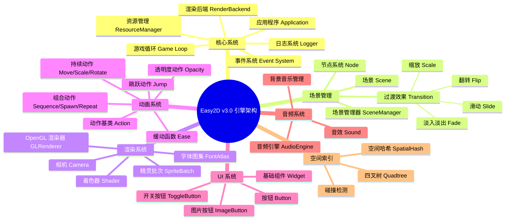
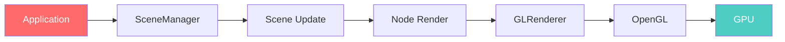
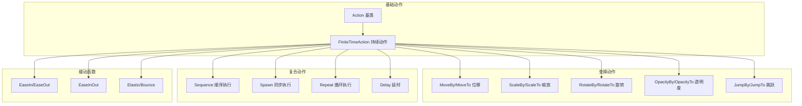

<div align="center">

# 🎮 Easy2D v3.0

<p align="center">
  <a href="#">
    
  </a>
  <a href="#">
    
  </a>
  <a href="#">
    
  </a>
</p>

<p align="center">
  <b>为 C++ 打造的现代化 2D 游戏引擎</b><br>
  <i>基于 OpenGL 的跨平台渲染 · 现代化架构设计 · 完整的场景管理</i>
</p>

[📖 快速开始](#-快速开始) | [🏗️ 架构概览](#-架构概览) | [🎮 示例游戏](#-示例游戏) | [📦 构建系统](#-构建系统)

</div>

---

## 🌟 简介

**Easy2D v3.0** 是一个基于现代 C++17 开发的 2D 游戏引擎，采用 OpenGL 渲染后端，支持 Windows、Linux 和 macOS 三大平台。引擎设计注重简洁性和可扩展性，提供了完整的场景管理、动画系统、UI 组件和音频支持。

> 💡 **设计理念**：提供游戏开发所需的核心工具，让开发者专注于游戏逻辑而非底层技术细节。

---

## 🗺️ 架构概览



---

## ✨ 功能特性

### 🎯 核心功能

| 功能模块 | 描述 | 状态 |
|:--------:|:-----|:----:|
| 🎭 场景管理 | 灵活的场景切换与堆栈管理 | ✅ |
| 🎨 过渡动画 | 6种过渡效果（淡入淡出、滑动、缩放、翻转） | ✅ |
| 🎬 动画系统 | 基于动作的可组合动画系统 | ✅ |
| 🔘 UI 系统 | 按钮、开关、图片按钮等组件 | ✅ |
| 🎵 音频支持 | WAV 格式音频播放，支持暂停/恢复 | ✅ |
| 🖼️ 渲染系统 | 基于 OpenGL 的硬件加速渲染 | ✅ |
| 📝 日志系统 | 基于 spdlog 的高性能日志 | ✅ |
| 🗂️ 资源管理 | 纹理、字体、音效统一管理 | ✅ |

### 🚀 渲染流程



### 🎬 动画系统



---

## 🚀 快速开始

### 环境要求

| 组件 | 最低版本 | 推荐版本 |
|:----:|:--------:|:--------:|
| Windows | Windows 7 | Windows 10/11 |
| Linux | Ubuntu 18.04 | Ubuntu 22.04 |
| macOS | 10.14 | 12.0+ |
| C++ 标准 | C++17 | C++17 |
| 构建工具 | xmake 2.5+ | 最新版 |

### 使用 xmake 构建

#### 步骤 1: 克隆仓库

```bash
git clone https://github.com/your-repo/easy2d-v3.git
cd easy2d-v3
```

#### 步骤 2: 配置并构建

```bash
# 配置项目（自动检测平台）
xmake f --mode=release

# 构建引擎和示例
xmake

# 运行推箱子游戏示例
xmake run push_box
```

#### 构建选项

```bash
# 使用 MinGW 工具链
xmake f --toolchain=mingw --mode=release

# 调试模式
xmake f --mode=debug

# 清理并重新构建
xmake clean
xmake -r
```

---

## 🎮 示例游戏

### 推箱子 (Push Box)

一个完整的推箱子游戏示例，展示了引擎的各项功能：

- **场景管理**：开始菜单、游戏场景、胜利界面
- **过渡效果**：场景切换时的淡入淡出效果
- **UI 系统**：按钮、开关按钮、图片按钮
- **音频系统**：背景音乐、移动音效、推箱子音效
- **数据持久化**：关卡进度保存、音量设置保存
- **键盘控制**：方向键移动，ESC 返回菜单，回车重开

```
examples/push_box/
├── src/
│   ├── assets/           # 游戏资源
│   │   ├── audio/        # 音效文件
│   │   └── images/       # 图片资源
│   ├── core/             # 核心逻辑
│   │   ├── data.h        # 游戏数据（地图定义）
│   │   ├── storage.h     # 数据持久化
│   │   └── audio_context.h # 音频上下文
│   ├── scenes/           # 场景定义
│   │   ├── start_scene.h # 开始菜单
│   │   ├── play_scene.h  # 游戏主场景
│   │   └── success_scene.h # 胜利界面
│   ├── nodes/            # 自定义节点
│   │   └── audio_controller.h # 音频控制器
│   ├── ui/               # UI 组件
│   │   └── menu_button.h # 菜单按钮
│   └── main.cpp          # 程序入口
```

### 运行示例

```bash
# 构建推箱子游戏
xmake build push_box

# 运行游戏
xmake run push_box
```

---

## 🏗️ 项目结构

```
Easy2D-v3/
├── 📁 include/                 # 头文件目录
│   ├── 📁 easy2d/              # 引擎头文件
│   │   ├── 📁 action/          # 动画系统
│   │   ├── 📁 app/             # 应用程序
│   │   ├── 📁 audio/           # 音频系统
│   │   ├── 📁 core/            # 核心类型
│   │   ├── 📁 event/           # 事件系统
│   │   ├── 📁 graphics/        # 渲染系统
│   │   ├── 📁 scene/           # 场景管理
│   │   ├── 📁 spatial/         # 空间索引
│   │   ├── 📁 ui/              # UI 组件
│   │   └── 📁 utils/           # 工具类
│   ├── 📁 glew/                # GLEW 库
│   ├── 📁 glfw/                # GLFW 库
│   └── 📁 glm/                 # GLM 数学库
├── 📁 src/                     # 源文件目录
│   ├── 📁 action/              # 动画系统实现
│   ├── 📁 app/                 # 应用程序实现
│   ├── 📁 audio/               # 音频系统实现
│   ├── 📁 graphics/            # 渲染系统实现
│   ├── 📁 scene/               # 场景管理实现
│   ├── 📁 ui/                  # UI 组件实现
│   └── 📁 utils/               # 工具类实现
├── 📁 examples/                # 示例项目
│   ├── 📁 hello_world/         # Hello World 示例
│   ├── 📁 font_test/           # 字体测试示例
│   └── 📁 push_box/            # 推箱子游戏
├── 📁 docs/                    # 文档
│   └── 📄 README.md            # 本文件
├── 📄 xmake.lua                # xmake 构建配置
├── 📄 .gitignore               # Git 忽略文件
└── 📄 LICENSE                  # 许可证文件
```

---

## 📝 Hello World 示例

```cpp
#include <easy2d/easy2d.h>

int main() {
    // 初始化日志系统
    easy2d::Logger::init();
    easy2d::Logger::setLevel(easy2d::LogLevel::Info);

    // 配置应用程序
    easy2d::AppConfig config;
    config.title = "Hello Easy2D";
    config.width = 800;
    config.height = 600;
    config.vsync = true;

    // 初始化应用程序
    auto& app = easy2d::Application::instance();
    if (!app.init(config)) {
        return -1;
    }

    // 创建并进入场景
    app.enterScene(easy2d::makePtr<easy2d::Scene>());

    // 运行游戏循环
    app.run();

    // 清理资源
    app.shutdown();
    easy2d::Logger::shutdown();
    return 0;
}
```

---

## 📋 API 速查

### 应用程序

| 方法 | 说明 |
|:-----|:-----|
| `Application::instance()` | 获取应用程序单例 |
| `app.init(config)` | 初始化应用程序 |
| `app.run()` | 启动游戏循环 |
| `app.quit()` | 退出应用程序 |
| `app.enterScene(scene)` | 进入场景 |
| `app.scenes().replaceScene(scene, transition, duration)` | 替换场景（带过渡效果） |

### 场景管理

| 方法 | 说明 |
|:-----|:-----|
| `SceneManager::pushScene(scene)` | 推入场景 |
| `SceneManager::popScene()` | 弹出场景 |
| `SceneManager::replaceScene(scene)` | 替换当前场景 |
| `SceneManager::replaceScene(scene, transition, duration)` | 替换场景（带过渡效果） |

### 节点操作

| 方法 | 说明 |
|:-----|:-----|
| `node->setPosition(x, y)` | 设置位置 |
| `node->setScale(sx, sy)` | 设置缩放 |
| `node->setRotation(angle)` | 设置旋转角度 |
| `node->setOpacity(value)` | 设置透明度 |
| `node->runAction(action)` | 运行动作 |
| `node->addChild(child)` | 添加子节点 |
| `node->removeFromParent()` | 从父节点移除 |

### 动作系统

| 动作 | 说明 | 示例 |
|:-----|:-----|:-----|
| `MoveBy` | 相对移动 | `makePtr<MoveBy>(duration, dx, dy)` |
| `MoveTo` | 绝对移动 | `makePtr<MoveTo>(duration, x, y)` |
| `ScaleBy` | 相对缩放 | `makePtr<ScaleBy>(duration, sx, sy)` |
| `RotateBy` | 相对旋转 | `makePtr<RotateBy>(duration, angle)` |
| `OpacityTo` | 透明度变化 | `makePtr<OpacityTo>(duration, opacity)` |
| `Sequence` | 顺序执行 | `makePtr<Sequence>({action1, action2})` |
| `Spawn` | 同步执行 | `makePtr<Spawn>({action1, action2})` |
| `Repeat` | 循环执行 | `makePtr<Repeat>(action, times)` |
| `EaseInOut` | 缓动效果 | `makePtr<EaseInOut>(action)` |

### 事件处理

| 事件类型 | 说明 |
|:---------|:-----|
| `UIHoverEnter` | 鼠标悬停进入 |
| `UIHoverExit` | 鼠标悬停退出 |
| `UIPressed` | 鼠标按下 |
| `UIReleased` | 鼠标释放 |
| `UIClicked` | 鼠标点击 |

---

## 🛠️ 技术栈

| 技术 | 用途 | 版本 |
|:----:|:-----|:----:|
| OpenGL | 3D 图形渲染 | 3.3+ |
| GLEW | OpenGL 扩展加载 | 2.1+ |
| GLFW | 窗口和输入管理 | 3.3+ |
| GLM | 数学库 | 0.9.9+ |
| miniaudio | 音频播放 | 最新版 |
| spdlog | 日志系统 | 最新版 |
| xmake | 构建系统 | 2.5+ |

---

## 🗓️ 版本历史

### v3.0.0 (当前版本)

- ✅ **全新架构**：基于 OpenGL 的现代渲染后端
- ✅ **跨平台支持**：Windows、Linux、macOS
- ✅ **场景过渡**：6种内置过渡效果
- ✅ **UI 系统**：完整的按钮和事件系统
- ✅ **音频系统**：基于 miniaudio 的音频播放
- ✅ **空间索引**：四叉树和空间哈希支持
- ✅ **动画系统**：可组合的动画动作系统

---

## 🤝 贡献指南

欢迎提交 Issue 和 Pull Request！

1. Fork 本仓库
2. 创建特性分支 (`git checkout -b feature/AmazingFeature`)
3. 提交更改 (`git commit -m 'Add some AmazingFeature'`)
4. 推送到分支 (`git push origin feature/AmazingFeature`)
5. 打开 Pull Request

---

## 📄 许可证

本项目基于 [MIT](../LICENSE) 许可证开源。

```
MIT License

Copyright (c) 2024 Easy2D Contributors

Permission is hereby granted, free of charge, to any person obtaining a copy
of this software and associated documentation files (the "Software"), to deal
in the Software without restriction, including without limitation the rights
to use, copy, modify, merge, publish, distribute, sublicense, and/or sell
copies of the Software, and to permit persons to whom the Software is
furnished to do so, subject to the following conditions:

The above copyright notice and this permission notice shall be included in all
copies or substantial portions of the Software.
```

---

<div align="center">

**⭐ 如果这个项目对你有帮助，请给它一个 Star！**

Made with ❤️ by Easy2D Contributors

</div>
